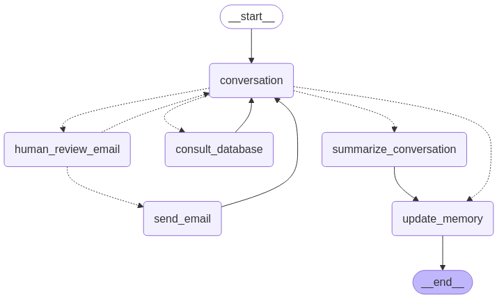
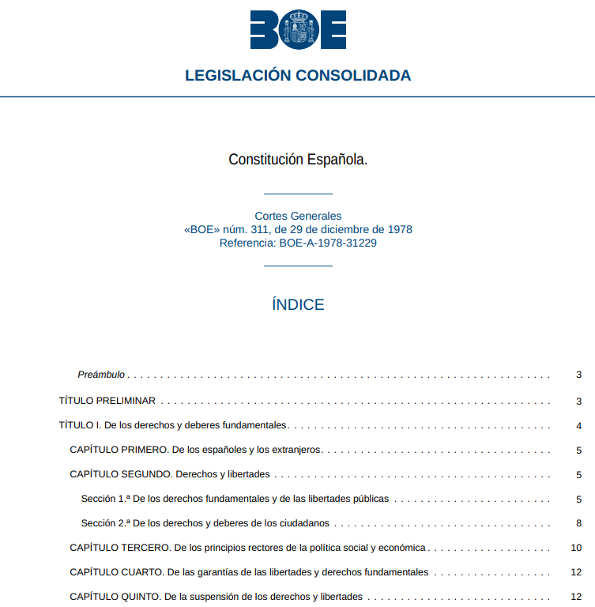
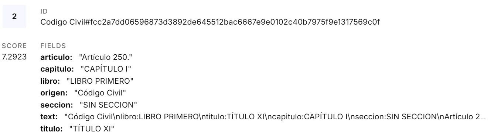
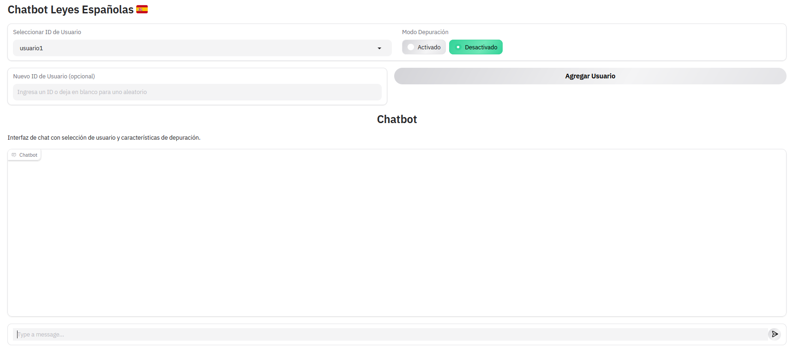
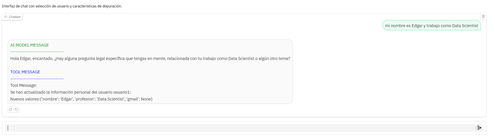
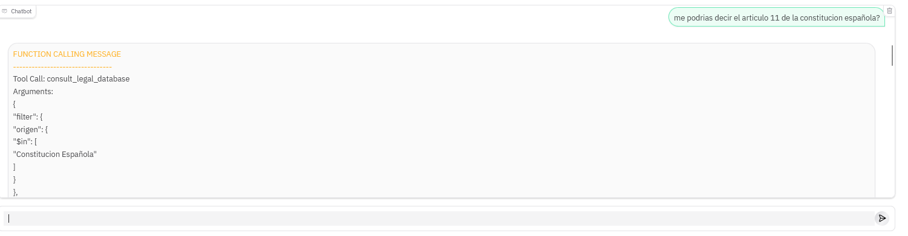
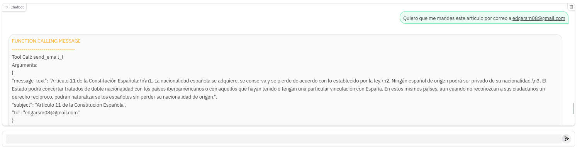
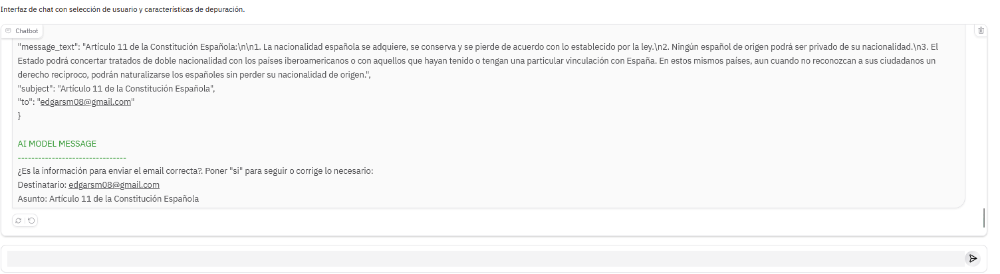
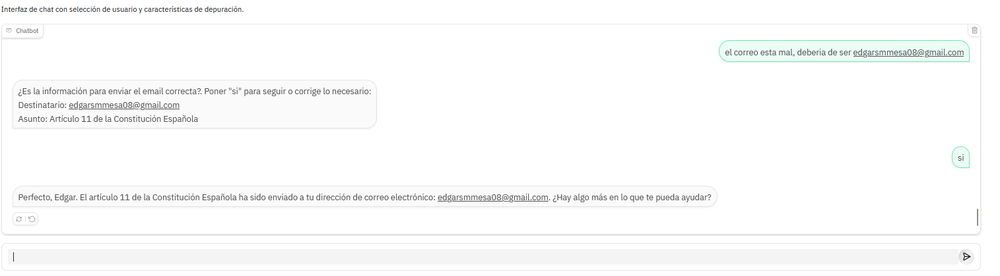
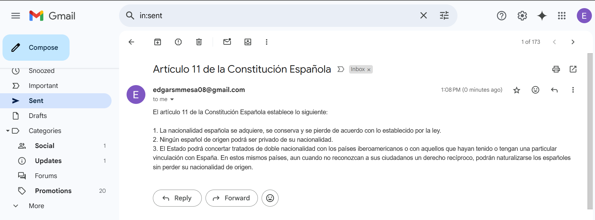

# Chatbot Leyes Españolas.

## Resumen de la herramienta.
Agente en forma de chatbot con interfaz gráfica, capaz de asistir con preguntas sobre las leyes españolas, como las que se encuentran en la Constitución Española, el Código Civil y el Código Penal. Este chatbot cuenta tanto con memoria dinámica a corto plazo como con memoria a largo plazo sobre características generales del usuario. Por último, también tiene la funcionalidad de enviar la información deseada por correo electrónico.

## Parseo de Documentos.
Al tratarse de documentos altamente organizados y con jerarquias (estructura BOE) se ha hecho un parseo ad-hoc para respetar estas jerarquias por cada bloque de información que se extraiga. Cada chunck de información representa un articulo en su totalidad ya que es la unidad de texto más lógica tanto a nivel de contenido como en tamaño (no todos los articulos estan relacionados por proximidad). Aunque gracias a mantener las jerarquias se podrian hacer todo tipo de sistemas mas complejos durante el retrieval

## Memoria.
### Short-term memory.
Como memoria de corto alcance, el agente se alimenta de una base de datos SQLite (guardado de checkpoints usando el built-in SqliteSaver). Además, una vez superados los 10.000 tokens, se crea un resumen de forma dinámica, manteniendo completos únicamente los últimos 12 mensajes 'summarize_conversation'.
### Long-term memory.
Al igual que en la memoria de corto plazo, se alimenta de una base de datos SQLite. Esta se encargará de almacenar los datos personales del usuario, como el nombre, el trabajo y el Gmail. Esta no utiliza la funcionalidad interna, por lo que ha sido necesario crear distintas funciones para extraer y guardar la información. Para el guardado, uno de los nodos 'update_memory', se encarga de identificar y actualizar la información del usuario en la base de datos.

## Herramientas.
### Consultar la base de datos vectorial.
Esta herramienta se le pasa al modelo como 'tool-calling' y la podrá utilizar cuando detecte que el usuario ha pedido información sobre leyes. Esta función se conecta con todo el sistema RAG y se le da libertad al modelo para ajustar parámetros como la propia query, los filtros de metadatos e incluso el parámetro alpha de la búsqueda híbrida para ponderar la búsqueda por keyword y la semántica. Este sistema RAG también incorpora un módulo de re-ranking para filtrar chunks no relevantes y modificar el orden que aparecen en el prompt. 
### Enviar email. 
Esta también se le pasa como 'tool-calling' y se ejecutará siempre que el modelo detecte la intención de que el usuario quiere que se le envíe un correo con alguna información. Los parámetros que el modelo debe elegir son el asunto, la información que solicita el usuario y el correo del destinatario.
Esta herramienta, al ejecutar una acción 'importante', tiene la particularidad de pasar por una verificación del usuario (human-in-the-loop) para comprobar si los parámetros son correctos. En caso de que el usuario responda 'sí', se enviará el correo; en caso de que el usuario solicite una modificación, se realizará el cambio y se preguntará nuevamente.

## Interfaz
Se ha creado una sencilla interfaz gráfica en Gradio para que se pueda interactuar con el chatbot. Es posible añadir y seleccionar usuarios para aprovechar las capacidades de memoria del agente, y además cuenta con un botón de 'depuración' para mostrar todos los mensajes adicionales de 'tool-calling' que no se muestran al usuario.

